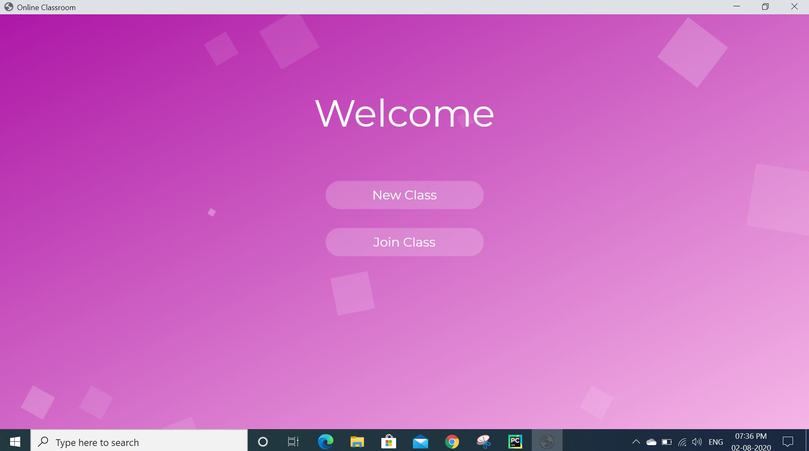
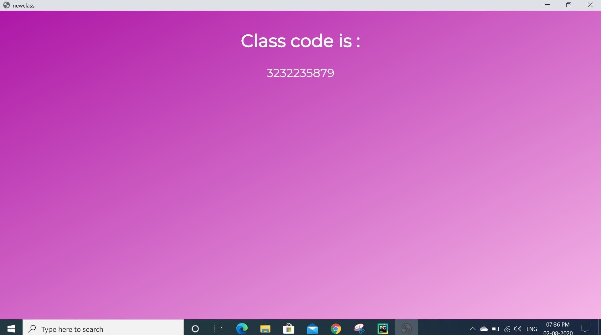
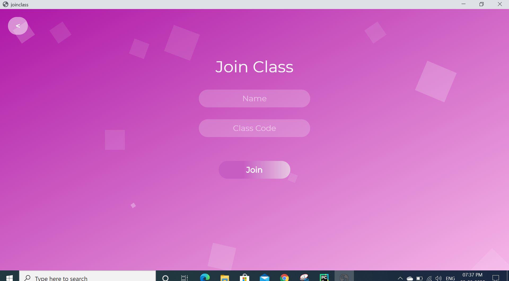
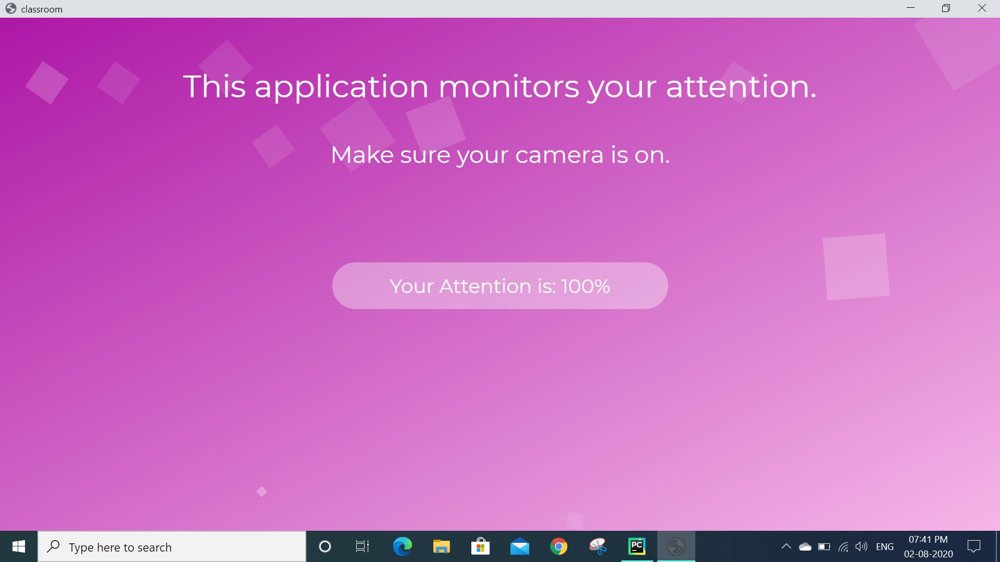
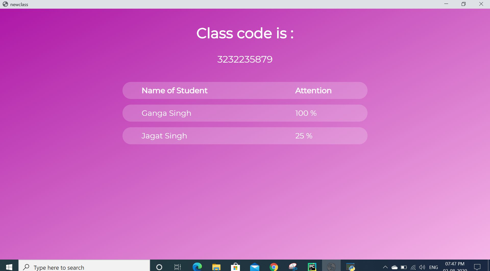

# Computer Vision based Student Attention Monitor 

The arrival of COVID-19 completely transformed the education system. In the wake of this medical emergency and keeping the student's safety in mind with their academics, the schools and colleges have endorsed online classes. In an online class the teacher is entirely unaware of the attentiveness of students. Analysing attentiveness through video of each student is a daunting task. Also, streaming video of all students on e -learning platforms can result in buffering.

The idea is to automate the task of monitoring attentiveness of students by analysing the video feed of each student through a webcam and streaming that analysis to the teacher which is displayed on a real-time dashboard. This application does not record or stream video from the student-side to the teacher-side instead it streams the attentiveness of each student after analysing the video feed of students through webcam.

### Entry Interface

### Create New Class

### Join Class

### Teacher Dashboard

